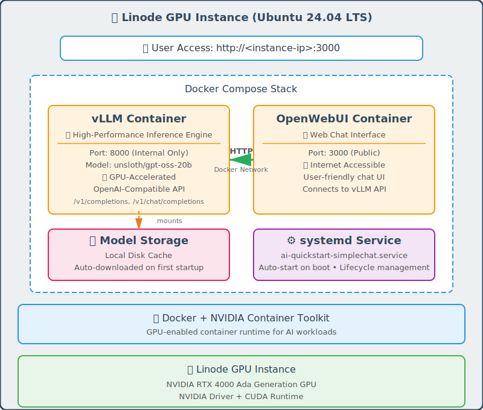

# Akamai inference Cloud - AI Quickstart Simple Chat

Automated deployment script for running a AI inference stack on Akamai Cloud (Linode) GPU instances. Get vLLM and Open-WebUI up and running in minutes with a single command.

-----------------------------------------
## 🚀 Quick Start

```bash
# Clone the repository
git clone https://github.com/linode/ai-quickstart-simplechat
cd ai-quickstart-simplechat

# Run the deployment script
./start.sh
```

The script will guide you through:
1. API authentication (linode-cli or OAuth)
2. Region selection
3. GPU instance type selection
4. Instance labeling
5. SSH key configuration
6. Automated deployment and health checks

## ✨ Features
- Fully Automated Deployment handles instance creation to service verification with real-time progress tracking
- Basic AI Stack: vLLM for LLM inference with pre-loaded model and Open-WebUI for chat interface
- Cross-Platform Support: Works on macOS and Windows (Git Bash/WSL)

-----------------------------------------

## 🏗️ What Gets Deployed



<br clear="left"/>

### Linode GPU Instance with
- Ubuntu 24.04 LTS with NVIDIA drivers
- Docker & Docker Compose
- NVIDIA Container Toolkit
- Systemd service for automatic startup on reboot

### Docker container
- **vLLM**: OpenAI-compatible API endpoint on port 8000
- **Open-WebUI**: Web-based chat interface on port 3000

> [!NOTE]
> if you like to add more containers check out docker compose template file
> ```
> vi /template/docker-compose.yml
> ```
> 

### Configuration files in GPU Instance
```
   # Install script called by cloud-init service
   /opt/ai-llm-basic/install.sh

   # docker compose file calle by systemctl at startup
   /opt/ai-llm-basic/docker-compose.yml
   
   # service definition
   /etc/systemd/system/ai-llm-basic.service
```

-----------------------------------------

## 📋 Requirements

### Akamai Cloud Account
- Active Linode account with GPU access enabled

### Local System Requirements
- **Required**: bash, curl, ssh, jq, netcat (nc)

-----------------------------------------
## 🚦 Getting Started

### 1. Just run start script with your terminal
```bash
./start.sh
```

### 2. Follow Interactive Prompts
The script will ask you to:
- Choose a region (e.g., us-east, eu-west)
- Select GPU instance type
- Provide instance label
- Select or generate SSH keys
- Confirm deployment

### 3. Wait for Deployment
The script automatically:
- Creates GPU instance in your linode account
- Monitors cloud-init installation progress
- Waits for Open-WebUI health check
- Waits for vLLM model loading

### 4. Access Your Services
Once complete, you'll see:
```
🎉 Setup Complete!

✅ Your AI LLM instance is now running!

🌐 Access URLs:
   Open-WebUI:  http://<instance-ip>:3000

🔐 Access Credentials:
   SSH:         ssh root@<instance-ip>
   SSH Key:     /path/to/your/key
```

-----------------------------------------

## 📁 Project Structure

```
ai-llm-basic/
├── start.sh                     # Main deployment script
├── script/
│   ├── check_linodecli_token.sh # Token extraction from linode-cli
│   ├── linode_oauth.sh          # OAuth flow for token generation
│   └── logo/                    # Akamai logo ASCII art
└── template/
    ├── compose.yml              # Docker Compose configuration
    └── install.sh               # Cloud-init installation script
```

-----------------------------------------
## 🔒 Security

**⚠️ IMPORTANT**: By default, ports 3000 are exposed to the internet

### Immediate Security Steps

1. **Configure Cloud Firewall** (Recommended)
   - Create Linode Cloud Firewall
   - Restrict access to ports 3000 by source IP
   - Allow SSH (port 22) from trusted IPs only

2. **SSH Security**
   - SSH key authentication required
   - Root password provided for emergency console access only

-----------------------------------------
## 🛠️ Useful Commands

### Check Service Status
```bash
# SSH into your instance
ssh root@<instance-ip>

# Check container status
docker ps

# Check Docker containers log
cd /opt/ai-llm-basic && docker compose logs

# Check systemd service
journalctl -u ai-llm-basic.service -n 10000 | awk '!seen[$0]++'

# Check cloud-init logs
tail -f /var/log/cloud-init-output.log -n 1000

```

### Restart Services
```bash
# Restart all services
systemctl restart ai-llm-basic.service

# Or using Docker Compose
cd /opt/ai-llm-basic
docker compose restart
```

### Check vLLM Model Status
```bash
# Check loaded models
curl http://localhost:8000/v1/models
```

### Check Open-WebUI Health
```bash
# Health check endpoint
curl http://localhost:3000/health
```

## 🐛 Troubleshooting

### Deployment Fails
The script offers to delete failed instances automatically when errors occur at:
- Instance fails to reach 'running' status
- Timeout waiting for cloud-init (5 minutes)
- Instance fails to become accessible

### Services Not Starting
```bash
# Check NVIDIA drivers
nvidia-smi

# Check Docker
docker ps -a

# Check systemd service
systemctl status ai-llm-basic.service

# View detailed logs
journalctl -u ai-llm-basic.service -xe
```

### vLLM Model Not Loading
```bash
# Check vLLM logs
docker logs vllm

# Check GPU availability
nvidia-smi

# Restart vLLM
docker compose restart vllm
```

## 🤝 Contributing

Issues and pull requests are welcome! For major changes, please open an issue first to discuss what you would like to change.

## 📄 License

This project is licensed under the Appatch .

